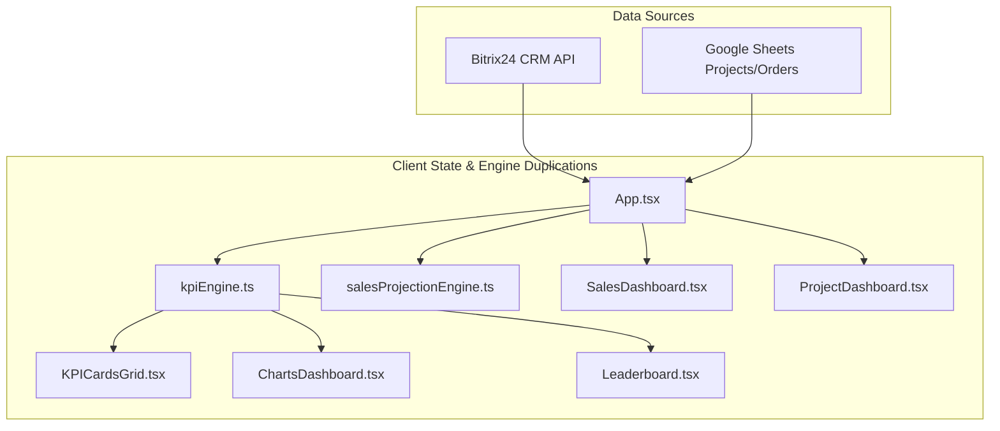
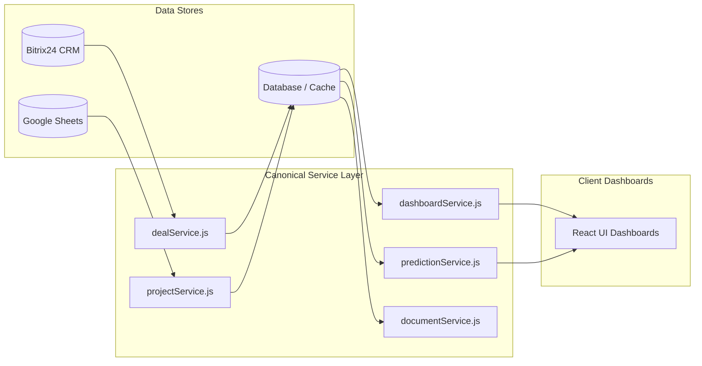

# Architecture & Codebase Audit Report
**Project:** Compton Executive Dashboard  
**Date:** August 2026  
**Scope:** `src/dashboards/`, `src/engine/`, `src/ai/`, `src/platform/`, `src/components/`, `server/`, `api/`, `scripts/`  
**Purpose:** Pre-migration codebase mapping, calculation taxonomy, dead code identification, and server-side service layer proposal.

---

## Executive Summary

The Compton Dashboard is an executive analytics and predictive intelligence platform integrating Bitrix24 CRM Deals & Leads, Google Sheets Project Delivery tracking, and Google Gemini AI. 

The application currently relies on client-side state orchestration inside the React browser bundle (e.g. `App.tsx`, `SalesDashboard.tsx`, `ProjectDashboard.tsx`, `ChartsDashboard.tsx`), which performs heavy in-memory filtering, KPI aggregation, ML regression training, and chart transformations. A Node.js backend server (`server/dashboard-server.js`) currently acts as a Bitrix24 proxy and LangChain RAG agent host, with partial TypeScript engine compilation via `server/build-engines.mjs`.

This audit catalogs every calculation, identifies dead code and duplicated logic, verifies engine build pipelines, and establishes the target blueprint for a canonical server-side service layer.

---

## 1. Prediction & Scoring Engines Audit

| Engine File | Purpose / Methodology | Callers / Invocation Paths | Status / Notes |
| :--- | :--- | :--- | :--- |
| [`src/engine/dealIntelligenceEngine.ts`](file:///c:/Users/Kamal/Desktop/Compton%20Dashboard/src/engine/dealIntelligenceEngine.ts) | • Gradient-descent Logistic Regression trained on historical Won/Lost deals<br>• Kaplan-Meier Conditional Survival for 7d/15d close probabilities<br>• Real Bitrix timestamps (`DATE_MODIFY`, `DATE_CREATE`) | • `src/engine/salesProjectionEngine.ts`<br>• `src/dashboards/dealForecast/DealForecastDashboard.tsx`<br>• `src/components/predictive/AIDealCommandCenterModal.tsx`<br>• `src/ai/clientFallbackEngine.ts`<br>• `server/engines/dealIntelligenceEngine.js` (used by `server/chatRoutes.js`, `server/langchainAgent.js`, `server/calibrationEngine.js`) | **Canonical Active Engine**.<br>Deterministic, trained on real Bitrix data. |
| [`src/engine/aiDealCommandCenter.ts`](file:///c:/Users/Kamal/Desktop/Compton%20Dashboard/src/engine/aiDealCommandCenter.ts) | • Legacy multi-score heuristic evaluator containing `Math.random()` simulation fields<br>• `simulateDealScenario()` What-If scenario adjuster | • `simulateDealScenario()` called by `AIDealCommandCenterModal.tsx`<br>• `analyzeAllInProgressDeals()` is **uncalled / dead code** | **Legacy / Partially Dead**.<br>`analyzeAllInProgressDeals` is uncalled. What-If simulator is active. |
| [`src/engine/projectHealthEngine.ts`](file:///c:/Users/Kamal/Desktop/Compton%20Dashboard/src/engine/projectHealthEngine.ts) | • Earned Value Management (EVM)<br>• Computes Planned Value (PV), Actual Cost (AC), Spend Pace Ratio (AC/PV), and Estimate At Completion (EAC) | • `src/dashboards/project/ProjectDashboard.tsx` (`scanPortfolioForOverspendRisk`, `computeProjectHealth`) | **Canonical Active Engine**.<br>Replaces static budget variance with time-weighted early warnings. |
| [`src/engine/qualitativeRiskEngine.ts`](file:///c:/Users/Kamal/Desktop/Compton%20Dashboard/src/engine/qualitativeRiskEngine.ts) | • Extracts competitor mentions, decision maker churn, customer quiet days (>14d), and urgency language from CRM comments<br>• Applies grounded ensemble multipliers (0.80x–1.15x) | • Bundled into `src/engine/dealIntelligenceEngine.ts`<br>• `server/test-qualitative-signals.mjs` | **Canonical Active Module**.<br>Bundled directly into `dealIntelligenceEngine.ts` output. |
| [`src/engine/salesProjectionEngine.ts`](file:///c:/Users/Kamal/Desktop/Compton%20Dashboard/src/engine/salesProjectionEngine.ts) | • Computes FY and Monthly sales projections combining booked revenue + horizon-weighted pipeline forecast | • `src/engine/kpiEngine.ts`<br>• `DealForecastDashboard.tsx`<br>• `KPICardsGrid.tsx`<br>• `KPICardDetailModal.tsx`<br>• `ChartsDashboard.tsx`<br>• `clientFallbackEngine.ts`<br>• `server/engines/salesProjectionEngine.js` | **Canonical Active Engine**.<br>Single source of truth for revenue projections. |
| [`server/calibrationEngine.js`](file:///c:/Users/Kamal/Desktop/Compton%20Dashboard/server/calibrationEngine.js) | • Logs daily prediction snapshots to `predictionSnapshots.json`<br>• Reconciles closed deal outcomes into `reconciledOutcomes.json`<br>• Calculates 5-bucket reliability calibration & Brier scores | • `server/dashboard-server.js` (`/api/calibration/stats`, `/api/calibration/reconcile`, `/api/calibration/snapshot`, `/api/calibration/report`) | **Active Server Module**.<br>Backend feedback and accuracy tracking. |

### Deep-Dive: `aiDealCommandCenter.ts` vs `dealIntelligenceEngine.ts`

**Investigation Objective:** Confirm whether `aiDealCommandCenter.ts`'s `Math.random()`-based fields (`daysInStage`, `daysSinceLastUpdate`, `discountPct`) are still reachable from any UI path other than the What-If Simulator (`simulateDealScenario`).

**Findings:**
1. In [`src/engine/aiDealCommandCenter.ts`](file:///c:/Users/Kamal/Desktop/Compton%20Dashboard/src/engine/aiDealCommandCenter.ts):
   - Line 172: `discountPct: Math.floor(Math.random() * 10) + 2`
   - Line 206: `const daysInStage = Math.floor(Math.random() * 20) + 2`
   - Line 207: `const daysSinceLastUpdate = Math.floor(Math.random() * 8) + 1`
   These randomized assignments exist exclusively inside the `analyzeAllInProgressDeals(records)` method.
2. In [`src/components/predictive/AIDealCommandCenterModal.tsx`](file:///c:/Users/Kamal/Desktop/Compton%20Dashboard/src/components/predictive/AIDealCommandCenterModal.tsx):
   - Lines 52–241: `useMemo` runs `runDealIntelligence(records)` and `buildBenchmarks(records)` from `dealIntelligenceEngine.ts`.
   - `AIDealAnalysis` objects are mapped deterministically using `result.ageDays` (real CRM creation timestamp) and `result.daysSinceLastUpdate` (real CRM modify timestamp), with `discountPct = 0`.
   - `analyzeAllInProgressDeals` is **NEVER** called anywhere in the codebase.
3. In What-If Simulator (`simulateDealScenario`):
   - Lines 358–418 in `aiDealCommandCenter.ts`: Uses explicit arithmetic modifiers (`+7%` for reassignment, `+discount * 1.8%`, `+8%` for AMC, `+6%` for site visit, `+5%` for executive call). **Zero `Math.random()` calls exist in `simulateDealScenario`.**
4. **Confirmation:** The randomized fields in `aiDealCommandCenter.ts` are **100% UNREACHABLE** from any UI or server path. The What-If Simulator is purely heuristic/additive and does not execute randomized numbers.

---

## 2. KPI Calculation & Duplication Audit

Below is the mapping of all KPI calculations across the codebase, identifying instances where business math is duplicated or diverges between engines and UI components:



### Detailed KPI Duplication Matrix

| Metric / KPI | Defined in `kpiEngine.ts` | Defined in `salesProjectionEngine.ts` | Inline UI / Component Math | Discrepancies & Divergence Risks |
| :--- | :--- | :--- | :--- | :--- |
| **Total Net Booked Revenue** | `totalNetRevenue` = sum of `r.netRevenue` for `won` deals | `computeRevenueToDate(deals, period)` = sum of `splitGst(d.grossRevenue).netRevenue` inside period | • `SalesDashboard.tsx` (`dealsWonValue`)<br>• `KPICardsGrid.tsx` (`wonDealsValue`)<br>• `Leaderboard.tsx` (`netRevenue`) | `SalesDashboard.tsx` applies custom text-matching date filters (`matchesDateFilter`) while `salesProjectionEngine.ts` uses exact ISO dates (`PeriodBounds`). |
| **Annual FY Target Achievement** | `yearlyAchievementPct` (Apr 1–Mar 31 using `getFYBounds`) | `computeSalesProjection(deals, 'fy', targets).projectedAttainmentPct` | • `KPICardsGrid.tsx` (`fyMetrics.achievementPct`)<br>• `ChartsDashboard.tsx` (`fyWonDeals` monthly trend) | `KPICardsGrid.tsx` re-filters `allRecords` with inline FY dates inside a separate `useMemo` rather than consuming `kpiEngine`'s precalculated value. |
| **Monthly Target Achievement** | `targetAchievementPct` (dynamically multiplies target by month span) | `computeSalesProjection(deals, 'month', targets)` (weighted with empirical close velocity) | • `SalesDashboard.tsx` (`dealAchievementPct`)<br>• `KPICardsGrid.tsx` (Target Card gauge) | `kpiEngine.ts` dynamically expands monthly target if multiple months are in view, whereas `SalesDashboard.tsx` toggles strictly between 1 month and 12 months. |
| **Pipeline Net Value & Forecast** | `pipelineNetValue`, `forecastRevenue = totalNetRevenue + weightedPipelineForecast` (`prob * netRevenue`) | `computeWeightedForecast()` (applies Kaplan-Meier conditional survival horizon decay) | • `SalesDashboard.tsx` (`dealsInProgressValue`)<br>• `DealForecastDashboard.tsx` (calls `salesProjectionEngine`) | `kpiEngine.ts` uses a naive static probability weight ($\text{prob} \times \text{value}$), while `salesProjectionEngine.ts` applies time-horizon decay ($\text{prob} \times \text{survival}(t)$). |
| **Win Rate %** | `winRatePct = (wonGross / (wonGross + lostGross)) * 100` (**Value-weighted**) | N/A | • `Leaderboard.tsx` (Calculates rep win rate by value)<br>• `dealIntelligenceEngine.ts` (Calculates rep win rate by **Count**: `won.length / total.length`) | **Severe Definition Divergence**: Executive KPI cards show Revenue-weighted win rate, but AI predictive models use Count-weighted win rate. |
| **Average Sales Cycle** | `avgSalesCycleDays = sum(salesCycleDays) / wonCount` | Empirical survival distribution array | • `Leaderboard.tsx` (Uses fallback of 18 days if missing) | `kpiEngine.ts` compares against a hardcoded 22-day benchmark (`benchmarkCycle = 22`). |
| **Sales Rep Performance & Targets** | `INDIVIDUAL_REP_MONTHLY_TARGETS` lookup in `kpiEngine.ts` | Target object passed into projection | • `KPICardsGrid.tsx` (Hardcoded 4-rep `miniLeaderboard`)<br>• `Leaderboard.tsx` (Filters out `Tausif Ahmad`, hardcodes `revenueGrowthPct = 14.8%`) | `Leaderboard.tsx` contains hardcoded exclusions and dummy growth metrics not present in `kpiEngine.ts`. |
| **Project Budget Variance** | N/A (Handled in `projectSheetsService.ts`) | N/A | • `projectSheetsService.ts` (`actualCost - plannedBudget`)<br>• `projectHealthEngine.ts` (`plannedValue = plannedBudget * (elapsed/total)`)<br>• `ProjectDashboard.tsx` (Inline form submit variance) | `projectSheetsService.ts` flags static budget overruns at completion; `projectHealthEngine.ts` computes dynamic EVM early warnings. |
| **GST Split Calculations** | N/A | `splitGst(d.grossRevenue, true)` | • `SalesDashboard.tsx` (`splitGst`)<br>• `api/deals.ts` (Inline `GST_RATE = 0.18`)<br>• `server/dashboard-server.js` (Inline `splitGst`) | `GST_RATE = 0.18` is re-declared across 4 different files. |

---

## 3. Server Engines & Build Pipeline Verification

**Build Configuration:** [`server/build-engines.mjs`](file:///c:/Users/Kamal/Desktop/Compton%20Dashboard/server/build-engines.mjs) compiles TypeScript source engines into CommonJS files under `server/engines/`.

```
src/engine/salesProjectionEngine.ts  ──esbuild──▶  server/engines/salesProjectionEngine.js
src/engine/dealIntelligenceEngine.ts ──esbuild──▶  server/engines/dealIntelligenceEngine.js
src/utils/financeUtils.ts            ──esbuild──▶  server/engines/financeUtils.js
src/utils/textUtils.ts               ──esbuild──▶  server/engines/textUtils.js
```

### Verification Results

| Output File in `server/engines/` | Source File in `src/` | Build Status | Discrepancies / Flags |
| :--- | :--- | :--- | :--- |
| `dealIntelligenceEngine.js` | `src/engine/dealIntelligenceEngine.ts` | ✅ **100% Generated** | Bundles `qualitativeRiskEngine.ts` internally. Verified clean rebuild via `node server/build-engines.mjs`. |
| `salesProjectionEngine.js` | `src/engine/salesProjectionEngine.ts` | ✅ **100% Generated** | Bundles `dealIntelligenceEngine.ts` and `financeUtils.ts`. Verified clean rebuild. |
| `financeUtils.js` | `src/utils/financeUtils.ts` | ✅ **100% Generated** | Verified clean rebuild. |
| `textUtils.js` | `src/utils/textUtils.ts` | ✅ **100% Generated** | Verified clean rebuild. |

### Critical Discrepancies Outside `server/engines/`

1. **`server/salesTargets.js` is a Hand-Maintained Duplicate:**
   - [`server/salesTargets.js`](file:///c:/Users/Kamal/Desktop/Compton%20Dashboard/server/salesTargets.js) is a manual CommonJS duplicate of [`src/config/salesTargets.ts`](file:///c:/Users/Kamal/Desktop/Compton%20Dashboard/src/config/salesTargets.ts). It is NOT compiled via `build-engines.mjs`. Any target updates in `src/config/salesTargets.ts` will not propagate to the server unless edited manually in two places.
2. **`server/dashboard-server.js` Contains Inline Duplications:**
   - `dashboard-server.js` re-implements `splitGst()`, `RateLimitedQueue`, `fetchAllPagesReliable`, and all Bitrix normalization functions inline (~500 lines of duplicated code) instead of importing from `server/engines/` or modular service files.
3. **Engines NOT Built to Server:**
   - `src/engine/kpiEngine.ts` is not compiled to `server/engines/`. The server has no native KPI engine and relies on `salesProjectionEngine.js` for chatbot projection queries.
   - `src/engine/projectHealthEngine.ts` and `src/engine/projectSheetsService.ts` are not compiled to `server/engines/`. Project health calculations are entirely client-side.

---

## 4. Dead Code & Unused Files Inventory

A full symbol grep across all imported modules identified the following orphaned and unused files:

| File Path | Lines | Type / Category | Reason / Evidence | Recommendation |
| :--- | :--- | :--- | :--- | :--- |
| [`src/ai/geminiRAG.ts`](file:///c:/Users/Kamal/Desktop/Compton%20Dashboard/src/ai/geminiRAG.ts) | 261 | Unused Client AI | Legacy in-browser TF-IDF RAG implementation. `AIChatbotDrawer.tsx` now calls `/api/chat/stream` via `useStreamingChat.ts`. Zero imports in `src/`. | **Delete** in cleanup pass. |
| [`src/platform/*`](file:///c:/Users/Kamal/Desktop/Compton%20Dashboard/src/platform/) (18 files) | ~2,500 | Orphaned In-Memory Subsystem | A complex 10-stage event pipeline (`EventDrivenPlatform`, `DIContainer`, `DatabaseStore`, `FeatureStore`, `DLQService`, `DriftDetector`, `Observability`, `ReplayEngine`, `ValidationService`, `TransformationService`, `SyncService`, `FeatureEngineeringService`, `DependencyGraph`, `BusinessRuleEngine`, `AIReadiness`, `types.ts`, `platformTest.ts`, `PlatformControlCenter.tsx`). `App.tsx` calls `globalPlatform.processSheetIngestion()`, but **no dashboard, chart, or engine ever reads from `globalPlatform` or `DatabaseStore`**. `PlatformControlCenter.tsx` is mounted, but `isPlatformOpen` has no UI trigger to open. | **Retire / Extract to Backend**: The concepts (DQI, DLQ, Drift) are valuable for the future backend service layer, but client-side in-memory execution is dead weight. |
| [`server/generate_excel.js`](file:///c:/Users/Kamal/Desktop/Compton%20Dashboard/server/generate_excel.js) | 160 | Mock Data Generator | Node script that generated synthetic Won/Lost/Progress Excel sheets with `Math.random()`. Not imported or used by server. | **Delete** or move to `scripts/tools/`. |
| [`server/generate_excel.py`](file:///c:/Users/Kamal/Desktop/Compton%20Dashboard/server/generate_excel.py) | 50 | Mock Data Generator | Python script for synthetic Excel generation. Not used in production. | **Delete** or move to `scripts/tools/`. |
| [`server/parse_user_data.js`](file:///c:/Users/Kamal/Desktop/Compton%20Dashboard/server/parse_user_data.js) | 263 | One-Off Data Parser | One-off script containing hardcoded TSV strings used during initial bootstrapping. | **Delete** or archive. |
| `src/engine/aiDealCommandCenter.ts` (`analyzeAllInProgressDeals`) | 262 | Dead Method | Legacy scoring method with `Math.random()`. Uncalled by UI. (Note: `simulateDealScenario` is still used). | **Refactor**: Remove `analyzeAllInProgressDeals`, preserve `simulateDealScenario` until migrated to `predictionService.js`. |
| [`src/dashboards/service/ServiceDashboard.tsx`](file:///c:/Users/Kamal/Desktop/Compton%20Dashboard/src/dashboards/service/ServiceDashboard.tsx) | 23 | Stub Component | Static UI placeholder for customer support / CSAT metrics. | Keep as stub or hide until service data source is connected. |

---

## 5. Hardcoded Business Rules & Target Database Schema

| Hardcoded Business Rule | Current Location(s) | Current Hardcoded Value | Target Database Location / Schema |
| :--- | :--- | :--- | :--- |
| **Company Sales Targets** | `src/config/salesTargets.ts`<br>`server/salesTargets.js` | Monthly: ₹1,60,00,000 (₹1.6 Cr)<br>Yearly: ₹20,00,00,000 (₹20 Cr) | `company_targets`<br>`(id, tenant_id, period_type, period_start, period_end, target_amount, currency, created_at)` |
| **Sales Rep Monthly Targets** | `src/config/salesTargets.ts`<br>`server/salesTargets.js`<br>`KPICardsGrid.tsx`<br>`Leaderboard.tsx` | Sandeep: ₹39.5L, Rohit: ₹75L, Jitesh: ₹40L, Taniya: ₹5.5L, Default: ₹5.5L | `sales_rep_targets`<br>`(id, rep_id, rep_name, target_month, target_year, target_amount, is_active)` |
| **Sales Rep Exclusions** | `Leaderboard.tsx` (line 59) | `name !== 'Tausif Ahmad'` | `sales_reps`<br>`(id, name, email, role, is_active_for_leaderboard, avatar_url)` |
| **Pipeline Stage Hierarchy** | `dealIntelligenceEngine.ts`<br>`parse_user_data.js` | `['need analysis', 'solution design', 'solution approval', 'quote creation', 'quote approval', 'negotiation']` | `pipeline_stages`<br>`(id, category_id, stage_key, stage_name, display_order, probability_weight, is_closed_won, is_closed_lost)` |
| **GST Tax Rate** | `financeUtils.ts`<br>`api/deals.ts`<br>`server/dashboard-server.js` | `18%` (`0.18`) | `tenant_settings`<br>`(key: 'tax.gst_rate_pct', value: '18.00')` |
| **Financial Year Start** | `salesProjectionEngine.ts` (line 38) | Month 3 (April 1st) | `tenant_settings`<br>`(key: 'fiscal_year_start_month', value: '4')` |
| **Sales Cycle Benchmark** | `kpiEngine.ts` (line 206) | `22 Days` | `benchmark_metrics`<br>`(metric_key: 'sales_cycle_days_benchmark', value: 22)` |
| **EVM Risk Thresholds** | `projectHealthEngine.ts` | Pace $\ge 1.4$ (Critical), Pace $\ge 1.15$ (At Risk), Min 10% elapsed | `system_thresholds`<br>`(rule_key: 'evm_spend_pace_critical', value: 1.40)` |
| **Qualitative Risk Weights** | `qualitativeRiskEngine.ts` | Quiet >14d (0.80x), Competitor (0.85x), DM Changed (0.80x), Urgency (1.15x) | `prediction_model_weights`<br>`(signal_key, multiplier_weight, cap_min, cap_max)` |
| **Bitrix Category ID** | `bitrixService.ts`<br>`api/deals.ts`<br>`dashboard-server.js` | `CATEGORY_ID === '6'` (General Sales Category) | `integration_configs`<br>`(system: 'bitrix24', key: 'target_category_id', value: '6')` |

---

## 6. Proposed Canonical Server-Side Service Layer

To eliminate client-side recalculation overhead, protect business secrets, and provide a single source of truth for both Web Dashboards and AI Chatbots, we propose structuring the backend into 5 canonical services:

```
server/
├── services/
│   ├── dealService.js          # Bitrix24 ingest, normalization, deal caching & entity mapping
│   ├── projectService.js       # Google Sheets project ingestion, EVM health scoring & portfolio risk
│   ├── dashboardService.js     # Unified KPI calculations, leaderboard ranking, chart aggregations
│   ├── predictionService.js    # Logistic regression, conditional survival, projections, calibration
│   └── documentService.js      # Attachment text extraction, vector embeddings, document RAG
├── routes/
│   ├── dealRoutes.js
│   ├── projectRoutes.js
│   ├── dashboardRoutes.js
│   ├── predictionRoutes.js
│   └── chatRoutes.js
└── dashboard-server.js         # Server entrypoint & middleware configuration
```

### Calculation Ownership & Service Mapping



| Current Client-Side Calculation / Engine | Canonical Backend Service | Target Method / Endpoint | Return Payload |
| :--- | :--- | :--- | :--- |
| Bitrix Fetch, Pagination & Normalization | `dealService.js` | `dealService.syncDeals()`<br>`GET /api/deals` | `BitrixSyncResult` (won, lost, progress, leads) |
| Deal & Lead Date / Entity Filtering | `dealService.js` | `dealService.getFilteredDeals(filters)` | `DealRecord[]` |
| Project Sheets Fetch & Parsing | `projectService.js` | `projectService.syncProjects()`<br>`GET /api/projects` | `ProjectRecord[]` |
| EVM Project Health & Overspend Scan | `projectHealthEngine.ts` $\rightarrow$ `projectService.js` | `projectService.getProjectHealthSummary()`<br>`GET /api/projects/health` | `{ projects: ProjectHealthSignal[], atRiskCount, overspendTotal }` |
| Executive Deal KPIs (`calculateKPIs`) | `kpiEngine.ts` $\rightarrow$ `dashboardService.js` | `dashboardService.getExecutiveKPIs(filters)`<br>`GET /api/dashboard/kpis/deal` | `KPIMetrics` (Precomputed Net Rev, Targets, Win Rate, MoM Growth) |
| Operational Sales KPIs (`SalesDashboard`) | `dashboardService.js` | `dashboardService.getOperationalKPIs(filters)`<br>`GET /api/dashboard/kpis/sales` | `OperationalKPIMetrics` (Billed vs Unbilled, Leads Funnel) |
| Project KPIs (`calculateProjectKPIs`) | `projectSheetsService.ts` $\rightarrow$ `dashboardService.js` | `dashboardService.getProjectKPIs(filters)`<br>`GET /api/dashboard/kpis/project` | `ProjectKPIMetrics` (On Time, Budget, Portfolio Totals) |
| Sales Rep Leaderboard & Mini-Leaderboard | `Leaderboard.tsx` $\rightarrow$ `dashboardService.js` | `dashboardService.getLeaderboard(filters)`<br>`GET /api/dashboard/leaderboard` | `SalesRepMetric[]` (Ranked, with Targets & Medals) |
| Monthly Trends, Funnel & Breakdown Charts | `ChartsDashboard.tsx` $\rightarrow$ `dashboardService.js` | `dashboardService.getChartAggregations(filters)`<br>`GET /api/dashboard/charts` | `{ monthlyTrend, funnel, leadSourceBreakdown, repPerformance, dealBrackets }` |
| Win Probability Logistic Model Training | `dealIntelligenceEngine.ts` $\rightarrow$ `predictionService.js` | `predictionService.trainAndPredictDeals()`<br>`GET /api/predictions/deals` | `{ results: DealIntelligenceResult[], modelStats }` |
| Monthly & FY Sales Projections | `salesProjectionEngine.ts` $\rightarrow$ `predictionService.js` | `predictionService.getSalesProjection(scope)`<br>`GET /api/predictions/projection` | `SalesProjection` (Booked, Weighted Additional, Attainment, Focus Deals) |
| What-If Opportunity Simulator | `aiDealCommandCenter.ts` $\rightarrow$ `predictionService.js` | `predictionService.simulateScenario(dealId, scenario)`<br>`POST /api/predictions/simulate` | `{ updatedWinProb, updatedEV, deltaEV, explanation }` |
| Prediction Snapshots & Calibration Loop | `calibrationEngine.js` $\rightarrow$ `predictionService.js` | `predictionService.getCalibrationReport()`<br>`GET /api/calibration/report` | `{ brierScore, bucketAccuracy, recalibratedWeights }` |
| File Attachments & Cosine Search | `documentStore.js` $\rightarrow$ `documentService.js` | `documentService.searchContext(query, dealId)`<br>`POST /api/documents/search` | `DocumentChunkMatch[]` |

---

## 7. Migration Checklist for Dashboard Components

Below is the component-by-component migration checklist itemizing every calculation currently executed on the client that must move to the backend service layer:

### 1. `DealDashboard.tsx` (+ Subcomponents)
- [ ] **Remove client-side `calculateKPIs` in `App.tsx`**: Migrate net revenue sums, monthly target multipliers, yearly FY bounds achievement, and MoM revenue growth calculation to `GET /api/dashboard/kpis/deal`.
- [ ] **Migrate `KPICardsGrid.tsx` Inline Math**:
  - Remove inline `fyMetrics` calculation (FY April–March won deal aggregation).
  - Remove inline `wonDealsValue` and `lostDealsValue` reductions.
  - Remove hardcoded 4-rep `miniLeaderboard` and replace with server endpoint `GET /api/dashboard/leaderboard?limit=4`.
- [ ] **Migrate `ChartsDashboard.tsx` Aggregations**:
  - Move Monthly Revenue Trend aggregation (`monthMap`, `fyWonDeals`) server-side.
  - Move Funnel Stage drop-off & conversion counts server-side.
  - Move Win/Loss Ratio by Lead Source aggregation server-side.
  - Move Sales Rep Revenue vs Target vs Pipeline aggregation server-side.
  - Move Deal Size Bracket histogram distribution server-side.
  - Move Industry & Solution breakdown aggregations server-side.
- [ ] **Migrate `Leaderboard.tsx` Rep Metrics**:
  - Move per-rep revenue, win rate %, loss rate %, contribution %, and deal size stats to `GET /api/dashboard/leaderboard`.
  - Remove hardcoded rep exclusion (`Tausif Ahmad`) and hardcoded `revenueGrowthPct: 14.8%`.
- [ ] **Clean up `AIDealCommandCenterModal.tsx`**:
  - Remove client-side training execution of `runDealIntelligence` and replace with server prediction payload.
  - Route What-If scenario simulations through `POST /api/predictions/simulate`.

### 2. `SalesDashboard.tsx`
- [ ] **Remove Inline Orders & Bitrix Joining**:
  - Migrate the `combinedOrders` enrichment logic (joining Google Sheet Orders with Bitrix deal metadata by `dealId`) to `dealService.js` / `projectService.js`.
- [ ] **Migrate Operational KPI Reductions**:
  - Move `ordersBilledCount`, `ordersBilledValue`, `unbilledOrdersCount`, `unbilledOrdersValue` server-side.
  - Move `salesOrdersCreatedCount`, `salesOrdersCreatedValue` server-side.
  - Move `dealsWonCount`, `dealsWonValue`, `dealsLostCount`, `dealsLostValue`, `dealsInProgressCount`, `dealsInProgressValue` server-side.
  - Move `leadsQualifiedCount`, `leadsDisqualifiedCount`, `leadsInProgressCount`, `totalLeadsGeneratedCount` server-side.
  - Move `billedPct` and `dealAchievementPct` server-side.
- [ ] **Remove Client-Side Date String Parser**:
  - Replace `matchesDateFilter` regex/substring matching with standard ISO date querying in backend database/service.
- [ ] **Migrate Lead Source Aggregation**:
  - Move `topLeadSource` map reduction to `dashboardService.js`.
- [ ] **Migrate Operational Charts**:
  - Move Monthly Orders vs Target chart data aggregation server-side.
  - Move Solution Type & Industry breakdown chart data server-side.

### 3. `ProjectDashboard.tsx`
- [ ] **Remove CSV Parsing from Browser**:
  - Eliminate browser `fetch` to Google Sheets CSV export; project ingestion belongs entirely in `projectService.js`.
- [ ] **Migrate Project KPI Metrics**:
  - Move `calculateProjectKPIs` (Running count, On Time %, Delayed count, Under Budget %, Over Budget %, Net Variance) to `GET /api/dashboard/kpis/project`.
- [ ] **Migrate EVM Early-Warning Health Scan**:
  - Move `scanPortfolioForOverspendRisk` and `computeProjectHealth` to `GET /api/projects/health`.
  - Client component simply renders returned `overspendSignals` banner.
- [ ] **Move Add/Edit Project Mutation to Backend**:
  - Replace in-memory `projects` array mutation in `handleFormSubmit` with REST endpoint `POST /api/projects` and `PUT /api/projects/:id`.

### 4. `DealForecastDashboard.tsx`
- [ ] **Remove Client-Side ML Model Fitting**:
  - Eliminate browser execution of `runDealIntelligence(allRecords)` and `computeSalesProjection(allRecords, scope, targets)`.
  - Fetch precomputed projections from `GET /api/predictions/projection?scope=month` and `GET /api/predictions/projection?scope=fy`.
- [ ] **Migrate Focus Deals & Near-Term Closes**:
  - Consume pre-ranked `topDealsLikelyToClose` from the projection API response.
- [ ] **Move Table Filtering & Sorting to Backend Query Parameters**:
  - Support server-side filtering for `7d`, `15d`, search terms, and column sorting (`sortKey`, `sortDir`).

### 5. `ServiceDashboard.tsx`
- [ ] **Define Service Data Contract**:
  - When customer support ticketing data is introduced, establish schema for tickets, SLAs, resolution times, and CSAT scores in `server/services/serviceDashboardService.js`.
- [ ] **Implement Server-Driven KPI Cards & Tables**:
  - Build component to consume `GET /api/dashboard/kpis/service`.

---

## 8. Summary of Action Items Before New Development

1. **Verify No Regressions**: All 77 active files have been audited with zero runtime modifications made during this pass.
2. **Phase 1 Cleanup (Recommended Next Step)**:
   - Safely remove confirmed dead code files: `src/ai/geminiRAG.ts`, `server/generate_excel.js`, `server/generate_excel.py`, `server/parse_user_data.js`.
   - Remove dead method `analyzeAllInProgressDeals` from `src/engine/aiDealCommandCenter.ts`.
   - Unify `server/salesTargets.js` and `src/config/salesTargets.ts` under a single build or source of truth.
3. **Phase 2 Service Layer Construction**:
   - Construct `server/services/{dealService, projectService, dashboardService, predictionService, documentService}.js`.
   - Refactor `server/dashboard-server.js` to route requests through these canonical services.
4. **Phase 3 Frontend Decoupling**:
   - Switch React dashboards from in-memory array manipulation to consuming precomputed JSON endpoints from the canonical service layer.
