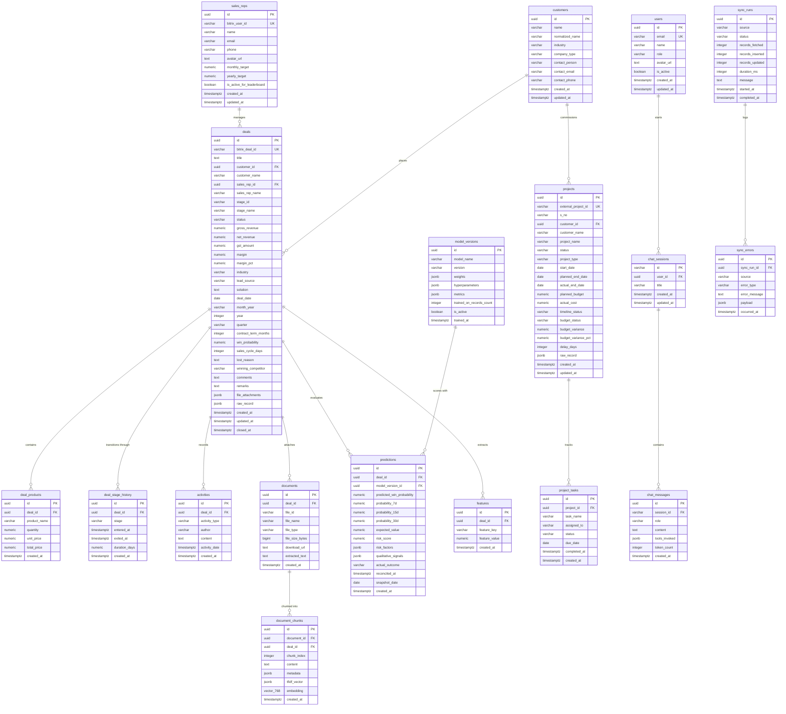

# Compton Dashboard Database Schema Specification

**Database Engine:** PostgreSQL 15+ / 16+ with `pgvector`, `uuid-ossp`, and `pg_trgm` extensions  
**Target Providers:** Supabase, Neon, AWS RDS Aurora Postgres, or Local PostgreSQL  
**Vector Embedding Model:** Google Gemini `gemini-embedding-001` / `text-embedding-004` (768 Dimensions)  
**Schema Version:** `001_initial_schema`

---

## 1. Entity Relationship Diagram (ERD)



---

## 2. Table Catalog & Data Dictionary

### 2.1 Identity & Master Tables

#### `users`
Stores system accounts, executive logins, and permissions.
| Column | Type | Constraints | Description |
| :--- | :--- | :--- | :--- |
| `id` | `UUID` | `PRIMARY KEY`, Default `uuid_generate_v4()` | Unique user identifier |
| `email` | `VARCHAR(255)` | `UNIQUE NOT NULL` | Login email address |
| `name` | `VARCHAR(255)` | `NOT NULL` | Display name |
| `role` | `VARCHAR(50)` | `NOT NULL DEFAULT 'viewer'` | Role: `admin`, `executive`, `sales_rep`, `viewer` |
| `avatar_url` | `TEXT` | `NULL` | Profile picture URL |
| `is_active` | `BOOLEAN` | `NOT NULL DEFAULT true` | Active flag |
| `created_at` | `TIMESTAMPTZ` | `NOT NULL DEFAULT NOW()` | Creation timestamp |
| `updated_at` | `TIMESTAMPTZ` | `NOT NULL DEFAULT NOW()` | Trigger-updated timestamp |

#### `sales_reps`
Stores CRM sales representatives, individual targets, and leaderboard attributes.
| Column | Type | Constraints | Description |
| :--- | :--- | :--- | :--- |
| `id` | `UUID` | `PRIMARY KEY`, Default `uuid_generate_v4()` | Internal representative UUID |
| `bitrix_user_id` | `VARCHAR(100)` | `UNIQUE NULL` | Bitrix24 `ASSIGNED_BY_ID` (e.g. `212`, `196`) |
| `name` | `VARCHAR(255)` | `NOT NULL` | Full Name (e.g. `Sandeep Vahi`, `Rohit Yadav`) |
| `email` | `VARCHAR(255)` | `NULL` | Business email |
| `phone` | `VARCHAR(50)` | `NULL` | Contact phone |
| `avatar_url` | `TEXT` | `NULL` | Headshot image URL |
| `monthly_target` | `NUMERIC(15,2)` | `NOT NULL DEFAULT 550000.00` | Monthly target quota (₹) |
| `yearly_target` | `NUMERIC(15,2)` | `NOT NULL DEFAULT 6600000.00` | Annual FY quota (₹) |
| `is_active_for_leaderboard` | `BOOLEAN` | `NOT NULL DEFAULT true` | Excludes support/admin users from sales leaderboard |
| `created_at` / `updated_at` | `TIMESTAMPTZ` | `NOT NULL DEFAULT NOW()` | Timestamps |

#### `customers`
Stores customer organizations and entities for deduplication and cross-table aggregation.
| Column | Type | Constraints | Description |
| :--- | :--- | :--- | :--- |
| `id` | `UUID` | `PRIMARY KEY`, Default `uuid_generate_v4()` | Customer UUID |
| `name` | `VARCHAR(255)` | `NOT NULL` | Customer Display Name |
| `normalized_name` | `VARCHAR(255)` | `NOT NULL` | Lowercase normalized string for fuzzy matching |
| `industry` | `VARCHAR(100)` | `DEFAULT 'General Industry'` | Primary industry vertical |
| `company_type` | `VARCHAR(100)` | `NULL` | Corporate, PSU, SME, Institution |
| `contact_person` | `VARCHAR(255)` | `NULL` | Primary POC |
| `contact_email` | `VARCHAR(255)` | `NULL` | Contact email |
| `contact_phone` | `VARCHAR(50)` | `NULL` | Contact phone |
| `created_at` / `updated_at` | `TIMESTAMPTZ` | `NOT NULL DEFAULT NOW()` | Timestamps |

---

### 2.2 CRM Deals & Commercials

#### `deals`
Primary transactional table mapping all fields from [`DealRecord`](file:///c:/Users/Kamal/Desktop/Compton%20Dashboard/src/types/sales.ts) and raw Bitrix24 deal objects.
| Column | Type | Constraints | Source Mapping (`DealRecord` / Bitrix) |
| :--- | :--- | :--- | :--- |
| `id` | `UUID` | `PRIMARY KEY`, Default `uuid_generate_v4()` | System UUID |
| `bitrix_deal_id` | `VARCHAR(100)` | `UNIQUE NOT NULL` | `DealRecord.id` (e.g. `BITRIX-2886`) / `ID` |
| `title` | `TEXT` | `NULL` | `rawRecord.TITLE` |
| `customer_id` | `UUID` | `FK -> customers(id) ON DELETE SET NULL` | Normalized customer reference |
| `customer_name` | `VARCHAR(255)` | `NOT NULL` | `DealRecord.customer` |
| `sales_rep_id` | `UUID` | `FK -> sales_reps(id) ON DELETE SET NULL` | Representative reference |
| `sales_rep_name` | `VARCHAR(255)` | `NOT NULL` | `DealRecord.salesRep` |
| `stage_id` | `VARCHAR(100)` | `NULL` | `rawRecord.STAGE_ID` |
| `stage_name` | `VARCHAR(100)` | `NOT NULL` | `DealRecord.stage` ('Need Analysis', 'Solution Design', etc.) |
| `status` | `VARCHAR(50)` | `NOT NULL CHECK (status IN ('won', 'lost', 'in_progress'))` | `DealRecord.type` |
| `gross_revenue` | `NUMERIC(15,2)` | `NOT NULL DEFAULT 0.00` | `DealRecord.grossRevenue` (`OPPORTUNITY`) |
| `net_revenue` | `NUMERIC(15,2)` | `NOT NULL DEFAULT 0.00` | `DealRecord.netRevenue` (Ex-GST) |
| `gst_amount` | `NUMERIC(15,2)` | `NOT NULL DEFAULT 0.00` | `DealRecord.gstAmount` (18% GST) |
| `margin` | `NUMERIC(15,2)` | `NOT NULL DEFAULT 0.00` | Estimated net margin (₹) |
| `margin_pct` | `NUMERIC(5,2)` | `NOT NULL DEFAULT 0.00` | `DealRecord.marginPct` (%) |
| `industry` | `VARCHAR(100)` | `NOT NULL DEFAULT 'General Industry'` | `DealRecord.industry` (`UF_CRM_67E4FF8E84730`) |
| `lead_source` | `VARCHAR(100)` | `NOT NULL DEFAULT 'Direct Inquiry'` | `DealRecord.leadSource` (`SOURCE_ID`) |
| `solution` | `TEXT` | `NOT NULL DEFAULT 'Enterprise Solutions'` | `DealRecord.solution` (`UF_CRM_1744361655612`) |
| `deal_date` | `DATE` | `NULL` | `DealRecord.date` (ISO `YYYY-MM-DD`) |
| `month_year` | `VARCHAR(50)` | `NULL` | `DealRecord.monthYear` (e.g. `2026-08`) |
| `year` | `INTEGER` | `NULL` | `DealRecord.year` (e.g. `2026`) |
| `quarter` | `VARCHAR(50)` | `NULL` | `DealRecord.quarter` (e.g. `Q2 2026`) |
| `contract_term_months` | `INTEGER` | `DEFAULT 12` | `DealRecord.contractTermMonths` |
| `win_probability` | `NUMERIC(5,2)` | `DEFAULT 50.00` | `DealRecord.winProbability` |
| `sales_cycle_days` | `INTEGER` | `DEFAULT 14` | `DealRecord.salesCycleDays` |
| `lost_reason` | `TEXT` | `NULL` | `DealRecord.lostReason` (`UF_CRM_1742536927863`) |
| `winning_competitor` | `VARCHAR(255)` | `NULL` | `DealRecord.winningCompetitor` |
| `comments` | `TEXT` | `NULL` | `DealRecord.comments` (Timeline notes) |
| `remarks` | `TEXT` | `NULL` | `DealRecord.remarks` (`UF_CRM_67EBCBB3098E8`) |
| `file_attachments` | `JSONB` | `NOT NULL DEFAULT '[]'::jsonb` | `DealRecord.fileAttachments` |
| `raw_record` | `JSONB` | `NOT NULL DEFAULT '{}'::jsonb` | `DealRecord.rawRecord` (Complete Bitrix JSON payload) |
| `created_at` / `updated_at` | `TIMESTAMPTZ` | `NOT NULL DEFAULT NOW()` | Bitrix `DATE_CREATE` & `DATE_MODIFY` |
| `closed_at` | `TIMESTAMPTZ` | `NULL` | Bitrix `CLOSEDATE` |

#### `deal_products`
Quoted line items and products extracted from `crm.deal.productrows.get`.
| Column | Type | Constraints | Description |
| :--- | :--- | :--- | :--- |
| `id` | `UUID` | `PRIMARY KEY` | Product row UUID |
| `deal_id` | `UUID` | `FK -> deals(id) ON DELETE CASCADE` | Parent deal reference |
| `product_name` | `VARCHAR(255)` | `NOT NULL` | Quoted product/SKU name |
| `quantity` | `NUMERIC(10,2)` | `NOT NULL DEFAULT 1.00` | Quoted quantity |
| `unit_price` | `NUMERIC(15,2)` | `NOT NULL DEFAULT 0.00` | Price per unit (₹) |
| `total_price` | `NUMERIC(15,2)` | `NOT NULL DEFAULT 0.00` | Total quoted row price (₹) |
| `created_at` | `TIMESTAMPTZ` | `NOT NULL DEFAULT NOW()` | Ingestion timestamp |

#### `deal_stage_history`
Tracks stage entry and exit timestamps to compute exact stage velocity and velocity bottlenecks.
| Column | Type | Constraints | Description |
| :--- | :--- | :--- | :--- |
| `id` | `UUID` | `PRIMARY KEY` | History event UUID |
| `deal_id` | `UUID` | `FK -> deals(id) ON DELETE CASCADE` | Parent deal reference |
| `stage` | `VARCHAR(100)` | `NOT NULL` | Stage name entered |
| `entered_at` | `TIMESTAMPTZ` | `NOT NULL` | Timestamp stage was entered |
| `exited_at` | `TIMESTAMPTZ` | `NULL` | Timestamp stage was transitioned or closed |
| `duration_days` | `NUMERIC(8,2)` | `NULL` | Computed days spent in this stage |
| `created_at` | `TIMESTAMPTZ` | `NOT NULL DEFAULT NOW()` | Record timestamp |

#### `activities`
Audit timeline of notes, calls, meetings, and CRM updates.
| Column | Type | Constraints | Description |
| :--- | :--- | :--- | :--- |
| `id` | `UUID` | `PRIMARY KEY` | Activity UUID |
| `deal_id` | `UUID` | `FK -> deals(id) ON DELETE CASCADE` | Parent deal reference |
| `activity_type` | `VARCHAR(50)` | `NOT NULL DEFAULT 'comment'` | Type: `comment`, `call`, `meeting`, `task`, `email`, `system` |
| `author` | `VARCHAR(255)` | `NULL` | Author name or user |
| `content` | `TEXT` | `NOT NULL` | Plaintext activity / note body |
| `activity_date` | `TIMESTAMPTZ` | `NOT NULL DEFAULT NOW()` | Timestamp of activity in CRM |
| `created_at` | `TIMESTAMPTZ` | `NOT NULL DEFAULT NOW()` | Ingestion timestamp |

---

### 2.3 Project Delivery (Google Sheets Ingest)

#### `projects`
Tracks client delivery projects, budgets, and EVM health metrics.
| Column | Type | Constraints | Source Mapping (`ProjectRecord`) |
| :--- | :--- | :--- | :--- |
| `id` | `UUID` | `PRIMARY KEY` | System UUID |
| `external_project_id` | `VARCHAR(100)` | `UNIQUE NOT NULL` | `ProjectRecord.id` (e.g. `proj-1`) |
| `s_no` | `VARCHAR(50)` | `NULL` | `ProjectRecord.sNo` |
| `customer_id` | `UUID` | `FK -> customers(id) ON DELETE SET NULL` | Linked customer account |
| `customer_name` | `VARCHAR(255)` | `NOT NULL` | `ProjectRecord.customerName` |
| `project_name` | `VARCHAR(255)` | `NOT NULL` | `ProjectRecord.projectName` |
| `status` | `VARCHAR(50)` | `NOT NULL DEFAULT 'Running'` | `ProjectRecord.status` (`Running`, `Completed`, `Delayed`, `On Hold`, `Planning`) |
| `project_type` | `VARCHAR(100)` | `NOT NULL DEFAULT 'General'` | `ProjectRecord.projectType` (`CCTV`, `Networking`, etc.) |
| `start_date` | `DATE` | `NULL` | `ProjectRecord.startDate` |
| `planned_end_date` | `DATE` | `NULL` | `ProjectRecord.plannedEndDate` |
| `actual_end_date` | `DATE` | `NULL` | `ProjectRecord.actualEndDate` |
| `planned_budget` | `NUMERIC(15,2)` | `NOT NULL DEFAULT 0.00` | `ProjectRecord.plannedBudget` (₹) |
| `actual_cost` | `NUMERIC(15,2)` | `NOT NULL DEFAULT 0.00` | `ProjectRecord.actualCost` (₹) |
| `timeline_status` | `VARCHAR(50)` | `NOT NULL DEFAULT 'On Time'` | `ProjectRecord.timelineStatus` (`On Time`, `Delayed`) |
| `budget_status` | `VARCHAR(50)` | `NOT NULL DEFAULT 'On Budget'` | `ProjectRecord.budgetStatus` (`Under Budget`, `On Budget`, `Over Budget`) |
| `budget_variance` | `NUMERIC(15,2)` | `NOT NULL DEFAULT 0.00` | `ProjectRecord.budgetVariance` |
| `budget_variance_pct` | `NUMERIC(8,2)` | `NOT NULL DEFAULT 0.00` | `ProjectRecord.budgetVariancePct` |
| `delay_days` | `INTEGER` | `NOT NULL DEFAULT 0` | `ProjectRecord.delayDays` |
| `raw_record` | `JSONB` | `NOT NULL DEFAULT '{}'::jsonb` | Full row object from Google Sheets |
| `created_at` / `updated_at` | `TIMESTAMPTZ` | `NOT NULL DEFAULT NOW()` | Timestamps |

#### `project_tasks`
Milestones and subtasks for projects.
| Column | Type | Constraints | Description |
| :--- | :--- | :--- | :--- |
| `id` | `UUID` | `PRIMARY KEY` | Task UUID |
| `project_id` | `UUID` | `FK -> projects(id) ON DELETE CASCADE` | Parent project |
| `task_name` | `VARCHAR(255)` | `NOT NULL` | Task deliverable name |
| `assigned_to` | `VARCHAR(255)` | `NULL` | Engineer or team member |
| `status` | `VARCHAR(50)` | `NOT NULL DEFAULT 'Pending'` | `Pending`, `In Progress`, `Completed`, `Blocked` |
| `due_date` | `DATE` | `NULL` | Target completion date |
| `completed_at` | `TIMESTAMPTZ` | `NULL` | Actual completion timestamp |
| `created_at` | `TIMESTAMPTZ` | `NOT NULL DEFAULT NOW()` | Creation timestamp |

---

### 2.4 Vector Store & Semantic Search (`pgvector`)

#### `documents`
Uploaded attachments, commercial proposals, and tender specifications.
| Column | Type | Constraints | Description |
| :--- | :--- | :--- | :--- |
| `id` | `UUID` | `PRIMARY KEY` | Document UUID |
| `deal_id` | `UUID` | `FK -> deals(id) ON DELETE SET NULL` | Associated deal |
| `file_id` | `VARCHAR(100)` | `NULL` | Remote Bitrix file ID (e.g. `8766`) |
| `file_name` | `VARCHAR(255)` | `NOT NULL` | File filename (e.g. `Quotation_Rev3.pdf`) |
| `file_type` | `VARCHAR(50)` | `DEFAULT 'pdf'` | File extension (`pdf`, `docx`, `xlsx`, `txt`) |
| `file_size_bytes` | `BIGINT` | `NULL` | File size |
| `download_url` | `TEXT` | `NULL` | Bitrix secure download URL |
| `extracted_text` | `TEXT` | `NULL` | Full parsed plaintext content |
| `created_at` | `TIMESTAMPTZ` | `NOT NULL DEFAULT NOW()` | Ingestion timestamp |

#### `document_chunks`
Vector store chunks indexed with **768-dimensional Google Gemini embeddings** and HNSW cosine similarity.
| Column | Type | Constraints | Description |
| :--- | :--- | :--- | :--- |
| `id` | `UUID` | `PRIMARY KEY` | Chunk UUID |
| `document_id` | `UUID` | `FK -> documents(id) ON DELETE CASCADE` | Parent document |
| `deal_id` | `UUID` | `FK -> deals(id) ON DELETE CASCADE` | Associated deal |
| `chunk_index` | `INTEGER` | `NOT NULL` | 0-indexed position within document |
| `content` | `TEXT` | `NOT NULL` | Text chunk (~1500 chars / ~500 tokens) |
| `metadata` | `JSONB` | `NOT NULL DEFAULT '{}'::jsonb` | Page numbers, headers, and section tags |
| `tfidf_vector` | `JSONB` | `NOT NULL DEFAULT '{}'::jsonb` | Sparse keyword tokens for hybrid search |
| `embedding` | `vector(768)` | `NULL` | **768-dim Google Gemini vector** (`vector_cosine_ops`) |
| `created_at` | `TIMESTAMPTZ` | `NOT NULL DEFAULT NOW()` | Chunk creation timestamp |

---

### 2.5 Machine Learning & Predictive Calibration

#### `model_versions`
Audit log of trained logistic regression models and calibration coefficients.
| Column | Type | Constraints | Description |
| :--- | :--- | :--- | :--- |
| `id` | `UUID` | `PRIMARY KEY` | Model UUID |
| `model_name` | `VARCHAR(100)` | `NOT NULL` | E.g. `logistic_deal_win_predictor` |
| `version` | `VARCHAR(50)` | `NOT NULL` | Version tag (e.g. `v1.2.0`) |
| `weights` | `JSONB` | `NOT NULL` | Feature weight dictionary and bias term |
| `hyperparameters` | `JSONB` | `NOT NULL DEFAULT '{}'::jsonb` | Learning rate, L2 regularization, epochs |
| `metrics` | `JSONB` | `NOT NULL DEFAULT '{}'::jsonb` | Training Brier score, log-loss, accuracy |
| `trained_on_records_count` | `INTEGER` | `DEFAULT 0` | Sample size used during training |
| `is_active` | `BOOLEAN` | `NOT NULL DEFAULT true` | Whether this is the active scoring model |
| `trained_at` | `TIMESTAMPTZ` | `NOT NULL DEFAULT NOW()` | Training completion timestamp |

#### `predictions`
Daily prediction snapshots, 7d/15d survival probabilities, and reconciled outcomes.
| Column | Type | Constraints | Description |
| :--- | :--- | :--- | :--- |
| `id` | `UUID` | `PRIMARY KEY` | Prediction UUID |
| `deal_id` | `UUID` | `FK -> deals(id) ON DELETE CASCADE` | Target deal |
| `model_version_id` | `UUID` | `FK -> model_versions(id) ON DELETE SET NULL` | Scoring model version |
| `predicted_win_probability` | `NUMERIC(5,2)` | `NOT NULL` | Primary Win Probability (0–100%) |
| `probability_7d` | `NUMERIC(5,2)` | `NULL` | Likelihood of closing within 7 days (%) |
| `probability_15d` | `NUMERIC(5,2)` | `NULL` | Likelihood of closing within 15 days (%) |
| `probability_30d` | `NUMERIC(5,2)` | `NULL` | Likelihood of closing within 30 days (%) |
| `expected_value` | `NUMERIC(15,2)` | `NULL` | Expected Revenue ($\text{Net Revenue} \times \text{Win Prob}$) |
| `risk_score` | `NUMERIC(5,2)` | `NULL` | Composite Risk Index (0–100) |
| `risk_factors` | `JSONB` | `NOT NULL DEFAULT '[]'::jsonb` | Array of identified qualitative risks |
| `qualitative_signals` | `JSONB` | `NOT NULL DEFAULT '{}'::jsonb` | Signal flags (`quietDays`, `competitorMentioned`, etc.) |
| `actual_outcome` | `VARCHAR(50)` | `CHECK (actual_outcome IN ('won', 'lost', NULL))` | Reconciled actual deal result |
| `reconciled_at` | `TIMESTAMPTZ` | `NULL` | Timestamp of outcome reconciliation |
| `snapshot_date` | `DATE` | `NOT NULL DEFAULT CURRENT_DATE` | Date snapshot was taken |
| `created_at` | `TIMESTAMPTZ` | `NOT NULL DEFAULT NOW()` | Creation timestamp |

#### `features`
Extracted feature vector attributes for individual deals.
| Column | Type | Constraints | Description |
| :--- | :--- | :--- | :--- |
| `id` | `UUID` | `PRIMARY KEY` | Feature UUID |
| `deal_id` | `UUID` | `FK -> deals(id) ON DELETE CASCADE` | Target deal |
| `feature_key` | `VARCHAR(100)` | `NOT NULL` | Feature identifier (`days_in_stage`, `rep_win_rate`) |
| `feature_value` | `NUMERIC(15,4)` | `NOT NULL` | Normalized numerical value |
| `created_at` | `TIMESTAMPTZ` | `NOT NULL DEFAULT NOW()` | Timestamp |

---

### 2.6 Sync Auditing & Conversational Memory

#### `sync_runs` & `sync_errors`
Comprehensive audit trail and Dead Letter Queue (DLQ) for all external Bitrix and Sheets ingestion jobs.
- `sync_runs`: Logs start/end timestamps, records fetched, updated, and duration in ms.
- `sync_errors`: Records unparseable payload chunks, rate limit exhaustion events, and schema mismatch alerts.

#### `chat_sessions` & `chat_messages`
Stores user conversational history, LangChain tool execution logs, and assistant streaming responses.
- `chat_sessions`: Session container indexed by `session_id`.
- `chat_messages`: Ordered message log storing `role` (`user`, `assistant`, `system`), `content`, and `tools_invoked` JSON array.

---

## 3. High-Performance Indexing Strategy

1. **HNSW Vector Index on Embeddings:**
   ```sql
   CREATE INDEX idx_doc_chunks_embedding_hnsw 
   ON document_chunks USING hnsw (embedding vector_cosine_ops)
   WITH (m = 16, ef_construction = 64);
   ```
2. **Trigram Index for Fast Text Search:**
   ```sql
   CREATE INDEX idx_deals_customer_trgm ON deals USING gin(customer_name gin_trgm_ops);
   CREATE INDEX idx_customers_name_trgm ON customers USING gin(name gin_trgm_ops);
   ```
3. **Composite B-Tree Indexes:**
   ```sql
   CREATE INDEX idx_deals_status_date ON deals(status, deal_date DESC);
   CREATE INDEX idx_chat_messages_session ON chat_messages(session_id, created_at ASC);
   CREATE INDEX idx_predictions_deal_date ON predictions(deal_id, snapshot_date DESC);
   ```
