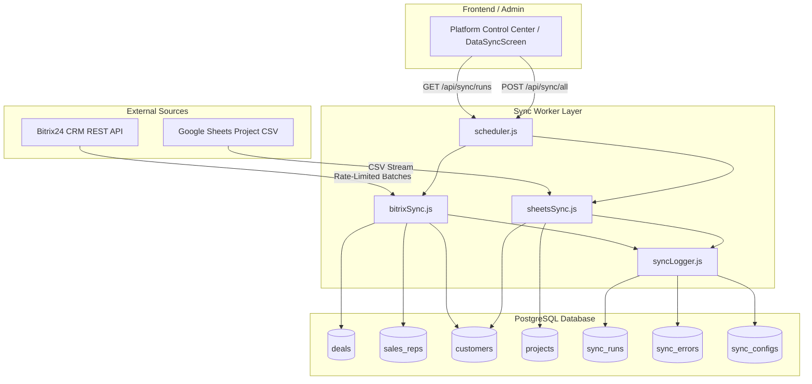

# Compton Dashboard ETL Sync Pipeline

This folder houses the server-side sync workers that continuously ingest, normalize, validate, and store CRM deals and project delivery tracking data into **PostgreSQL with pgvector**.

---

## 1. Architecture Overview



---

## 2. Ingestion Modules

### 2.1 `bitrixSync.js`
- **Rate-Limited Queue:** Reuses `RateLimitedQueue` with concurrency of 3, 300ms intervals, and exponential backoff retry.
- **Incremental Sync (`DATE_MODIFY`):** Checks `sync_configs` for `last_synced_at_bitrix24`. Ingests only deals modified after this timestamp (`FILTER[>DATE_MODIFY]=<timestamp>`), reducing network bandwidth by >95% on steady-state runs.
- **Batch Enrichment:** Uses `batch.json` to concurrently fetch timeline comments (`crm.timeline.comment.list`) and quoted product rows (`crm.deal.productrows.get`) in 25-deal chunks.
- **PostgreSQL Upsert:** Upserts sales reps into `sales_reps`, customers into `customers`, deals into `deals`, products into `deal_products`, and stage transitions into `deal_stage_history`.

### 2.2 `sheetsSync.js`
- **Google Sheets Ingest:** Converts standard Google Sheet edit URLs into high-speed CSV export streams (`/export?format=csv`).
- **Multiline CSV Parser:** Handles quoted commas, multiline remarks, currency strings (₹, Cr, Lakh), and date normalizations.
- **Variance Math & Validation:** Computes `budget_variance` ($\text{Actual} - \text{Planned}$), `budget_variance_pct`, `delay_days`, and timeline status.
- **PostgreSQL Upsert:** Upserts delivery projects into `projects` and synchronizes customer accounts.

### 2.3 `syncLogger.js`
- **ACID Run Tracking:** Inserts a `running` row on job start and guarantees a final update (`success`, `partial`, `error`) on completion with duration in milliseconds.
- **Dead Letter Queue (DLQ):** Captures individual malformed records, rate-limit exhausts, or schema mismatches in `sync_errors` without terminating the broader sync batch.

---

## 3. Scheduled Trigger Decision: Persistent Worker vs. Vercel Cron

### **Architectural Decision: Hybrid Dual-Trigger Architecture**

| Deployment Environment | Trigger Mechanism | Implementation Details |
| :--- | :--- | :--- |
| **Primary (Production / Self-Hosted Node.js / Docker)** | **Persistent Background Scheduler** | `startSyncScheduler(intervalMs)` runs within `dashboard-server.js` using Node.js background intervals. Executes full synchronization on boot and recurring background delta syncs every 5 minutes (`SYNC_INTERVAL_MS`). |
| **Serverless (Vercel)** | **Vercel Cron Jobs** | Configured via `vercel.json` crons hitting `GET /api/sync/cron` on a periodic schedule (e.g. `*/10 * * * *`). Protected by a shared `CRON_SECRET` bearer token header. |

#### Why this decision was made:
- For local development and self-hosted deployments, the persistent scheduler requires zero external infrastructure or third-party cron services.
- For Vercel deployments where serverless functions freeze between invocations, the Vercel Cron HTTP webhook reliably invokes `/api/sync/cron` within Vercel's execution limits.

---

## 4. API Endpoints Reference

| Method | Endpoint | Description | Query / Body Parameters |
| :--- | :--- | :--- | :--- |
| `POST` | `/api/sync/bitrix` | Triggers Bitrix24 incremental or full sync | `{ forceFullSync: true }` or `?force=true` |
| `POST` | `/api/sync/sheets` | Triggers Google Sheets Project Delivery sync | None |
| `POST` | `/api/sync/all` | Triggers complete sync (Bitrix + Sheets) | `{ forceFullSync: false }` |
| `GET` | `/api/sync/runs` | Fetches the last N sync execution rows & error counts | `?limit=25` (Default: 25) |
| `GET` | `/api/sync/cron` | Vercel Cron trigger endpoint | Headers: `Authorization: Bearer <CRON_SECRET>` |

---

## 5. Testing Sync Pipelines Manually

You can test the sync workers directly from the command line:

```bash
# Run Bitrix sync manually
node -e "require('./server/sync/bitrixSync').syncBitrixToPostgres().then(console.log)"

# Run Google Sheets sync manually
node -e "require('./server/sync/sheetsSync').syncProjectsSheetToPostgres().then(console.log)"

# Run full sync through the scheduler
node -e "require('./server/sync/scheduler').runAllSyncs().then(console.log)"
```
